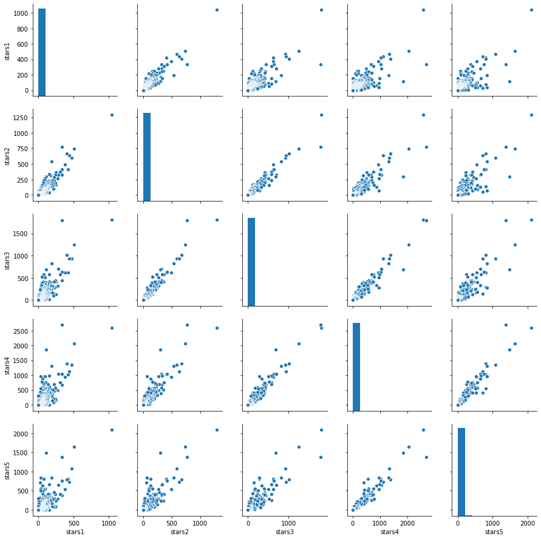
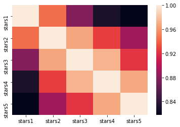
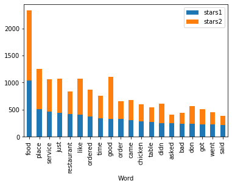
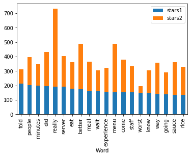
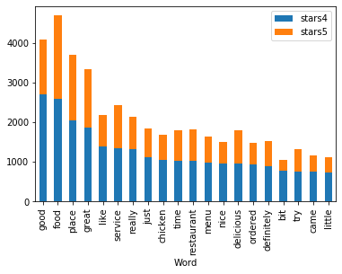
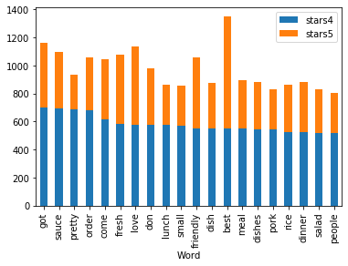
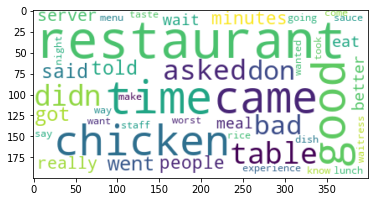
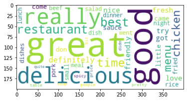

## Introduction

In this project i worked with one Chinese downtown toronto restaurant with reviews. my data set have 179238 rows and 10 columns. so i have to sample the data first to make it more easy to process by me computer.

I would like to check what people like or dislike about this restaurant. i have 10000 record of reviews that i want to transform to some useful information after sampling. 


First i should clean the texts. removing all symbols and numbers and special characters.

After cleaning the text i grouped the text by starts. in this way i can compare the text that the low starts comments with high start comments and check what these 2 groups talk about. i need to concatenate all the text for each group together and make a massive data set with 5 row for stars and each stars has one comments text.

now it is a time to count the text in each group. i victories the text for each group and it returns the starts in row and word list in columns 

after transpose the matrix i got the reasonable dataset with 9999 row and 6 columns.

I checked to scatter of word frequency between each group to see their relationship


correlation maps helped me to observe the strong relationship between 1 and 2 starts group . another interesting relationship is between 4 and 5 stars.

after that I tried to look at the most frequent used word in barplot and i saw we have so many similar words in the plot so i started to add them to stop watch before i generate my word cloud.

in the after making stopwatch i generated the wordclouds for these 2 group to compare.
2020-02-03 06:04


```python

```


```python
import numpy as np
import pandas as pd
import matplotlib.pylab as plt
import seaborn as sns
import re
from pandas.plotting import scatter_matrix
from os import path
from PIL import Image
from wordcloud import WordCloud, STOPWORDS, ImageColorGenerator


#####read data
def read_data():
    reviews = pd.read_csv('C:\\Users\\razer\\Desktop\\Python_class\\Phyton Project\\cusines reviews Toronto.csv')
    reviews.head()
    return(reviews)

#####sample data
def sample_data(reviews):
    np.random.seed(10800)
    reviews=reviews.sample(10000,replace=False)
    reviews.count()
    return(reviews)

## remove duplications in comments
def  drop_duplication(reviews):
    reviews.isnull().any()
    reviews.duplicated().sum()
    reviews.sort_values("text", inplace = True) 
    reviews.drop_duplicates(subset ="text", keep = 'first', inplace = True) 
    return(reviews)

##clean the text
def clean_data(reviews):
    reviews.isnull().any()
    reviews['text']=reviews.text.str.strip()
    reviews['text']=reviews.text.str.lower()
    reviews['text']=reviews.text.str.replace('.','')
    reviews['text']=reviews.text.str.replace('*','')
    reviews['text']=reviews.text.replace('$','')
    reviews['text']=reviews.text.replace(',','')
    r, c = reviews.shape
    for i in range(0,r-1):
        reviews.iloc[i,5]=re.sub(r'\d', '', reviews.iloc[i,5])
        reviews.iloc[i,5]=re.sub(r'\b\w{1,2}\b', '', reviews.iloc[i,5])
    return (reviews)  

#group by stars rate
def groupbyStars(reviews):
    def concat(x):
        result=''
        for i in x:
            result=result+' '+i
        return pd.Series(result)
    
    
    StarsGroup=reviews.groupby(reviews.stars)['text'].apply(concat)
    StarsGroup=pd.DataFrame(StarsGroup)
    StarsGroup.reset_index(level=0, inplace=True)
    StarsGroup.index=StarsGroup.stars
    return(StarsGroup)

###################################################### 
def CountVector(StarsGroup):  
    from sklearn.feature_extraction.text import CountVectorizer   
       
    cv=CountVectorizer(stop_words='english')
    data_cv=cv.fit_transform(StarsGroup.text)
    data_dtm=pd.DataFrame(data_cv.toarray(),columns=cv.get_feature_names())
    data_dtm.index=StarsGroup.index
    return (data_dtm)
   
#######################################
def Wordcount_byStars(Vector_data):
    
    data_new=Vector_data.transpose()
    data_new.columns=['stars1','stars2','stars3','stars4','stars5']
    data_new.info
    data_new=data_new.sort_values(by='stars1',ascending=False)
    data_new.reset_index(level=0, inplace=True)
    data_new.columns=['Word','stars1','stars2','stars3','stars4','stars5']
    return(data_new)
#############################################################################
def Plot_Scatter(WordCount):
    temp=WordCount.drop(['Word'],axis=1)
    g=sns.pairplot(temp)
    plt.show()
    
    

################# word cloud
def Plot_HeatMap(WordCount):
    temp=WordCount.drop(['Word'],axis=1)
    g_corr=WordCount.corr()
    sns.heatmap(g_corr)
    plt.show()

###########################################
def Plot_lowrate_bar(WordCount):  
    temp=WordCount.sort_values(by=['stars1','stars2'],ascending=False)[0:20]
    temp.plot('Word',['stars1','stars2'],kind='bar',stacked=True)
    temp=WordCount.sort_values(by=['stars1','stars2'],ascending=False)[20:40]
    temp.plot('Word',['stars1','stars2'],kind='bar',stacked=True)
#################################################    
def Plot_highrate_bar(WordCount):    
    temp=WordCount.sort_values(by=['stars4','stars5'],ascending=False)[0:20]
    temp.plot('Word',['stars4','stars5'],kind='bar',stacked=True) 
    temp=WordCount.sort_values(by=['stars4','stars5'],ascending=False)[20:40]
    temp.plot('Word',['stars4','stars5'],kind='bar',stacked=True)    
    
########################################################
def WordCloud_lowStars(WordCount): 
    temp=WordCount.sort_values(by=['stars1','stars2'],ascending=False)[:50]
    temp.reset_index(level=0, inplace=True)
    temp=temp.drop('index',axis=1)
    temp['Star1']=temp.stars1/10
    temp['Star1']=temp.Star1.astype('int')
    temp['Result_Star1']=(temp.Word+' ') *temp.Star1
    result=''
    for words in temp.Result_Star1:
        result=result+words
    stop_words = ["food", "place", "service","order",'ordered']+ list(STOPWORDS)
    temp = WordCloud( collocations = False,background_color="white",stopwords = stop_words).generate(result)
    plt.imshow(temp, interpolation='bilinear')
####################################################################
def WordCload_HighStars(WordCount): 
    temp=WordCount.sort_values(by=['stars4','stars5'],ascending=False)[:50]
    temp.reset_index(level=0, inplace=True)
    temp=temp.drop('index',axis=1)
    temp['Stars5']=temp.stars5/10
    temp['Stars5']=temp.Stars5.astype('int')
    temp['Result_Stars5']=(temp.Word+' ') *temp.Stars5
    result=''
    for words in temp.Result_Stars5:
        result=result+words
    stop_words = ["food", "place", "service","order",'ordered']+ list(STOPWORDS)
    temp = WordCloud( collocations = False,background_color="white",stopwords = stop_words).generate(result)
    plt.imshow(temp, interpolation='bilinear')


```


```python
reviews=read_data()

```

The list of columns are


```python
reviews.info()
```

    <class 'pandas.core.frame.DataFrame'>
    RangeIndex: 179239 entries, 0 to 179238
    Data columns (total 10 columns):
    id             179239 non-null object
    business_id    179239 non-null object
    user_id        179239 non-null object
    stars          179239 non-null int64
    date           179239 non-null object
    text           179239 non-null object
    useful         179239 non-null int64
    funny          179239 non-null int64
    cool           179239 non-null int64
    elite          179239 non-null object
    dtypes: int64(4), object(6)
    memory usage: 13.7+ MB
    

As the data is too huge for my computer so i sample the data first.


```python
reviews=sample_data(reviews)
reviews.info()
```

    <class 'pandas.core.frame.DataFrame'>
    Int64Index: 10000 entries, 136986 to 75660
    Data columns (total 10 columns):
    id             10000 non-null object
    business_id    10000 non-null object
    user_id        10000 non-null object
    stars          10000 non-null int64
    date           10000 non-null object
    text           10000 non-null object
    useful         10000 non-null int64
    funny          10000 non-null int64
    cool           10000 non-null int64
    elite          10000 non-null object
    dtypes: int64(4), object(6)
    memory usage: 859.4+ KB
    

I checked the record and found duplication rows so i desided to remove the duplications


```python
reviews=drop_duplication(reviews)
reviews.head()
```


<div>
<style scoped>
    .dataframe tbody tr th:only-of-type {
        vertical-align: middle;
    }

    .dataframe tbody tr th {
        vertical-align: top;
    }

    .dataframe thead th {
        text-align: right;
    }
</style>
<table border="1" class="dataframe">
  <thead>
    <tr style="text-align: right;">
      <th></th>
      <th>id</th>
      <th>business_id</th>
      <th>user_id</th>
      <th>stars</th>
      <th>date</th>
      <th>text</th>
      <th>useful</th>
      <th>funny</th>
      <th>cool</th>
      <th>elite</th>
    </tr>
  </thead>
  <tbody>
    <tr>
      <td>5906</td>
      <td>14lgC4_tM9e8LDDVZxaufw</td>
      <td>4wtqTzXPPp_6vBfFQKiTGQ</td>
      <td>mOVyk3O18VY5nrUMTZgM1w</td>
      <td>4</td>
      <td>2014-05-30 00:00:00</td>
      <td>#MILESTONES #YELP #FOOD #COCKTAILS\n\nI really...</td>
      <td>0</td>
      <td>0</td>
      <td>0</td>
      <td>Yes</td>
    </tr>
    <tr>
      <td>166992</td>
      <td>LHXvey8e-q9oKTxDZfq3gg</td>
      <td>kQyk1RDinqtGUsgfSlXJOQ</td>
      <td>imPfhpAk61DqSW6K47D4QQ</td>
      <td>5</td>
      <td>2011-11-28 00:00:00</td>
      <td>$2 for an excellent sandwich. Seriously it's o...</td>
      <td>1</td>
      <td>0</td>
      <td>0</td>
      <td>No</td>
    </tr>
    <tr>
      <td>53938</td>
      <td>DYsiy9timwBbFmUBC2YfFw</td>
      <td>ykhL6KkPUq-ruDl0iyb0Ig</td>
      <td>Mtavj9UzKi12Ou5n0zeKwQ</td>
      <td>1</td>
      <td>2016-04-08 00:00:00</td>
      <td>$6.20 for a dinner was tempting but the food w...</td>
      <td>0</td>
      <td>1</td>
      <td>0</td>
      <td>No</td>
    </tr>
    <tr>
      <td>150948</td>
      <td>fcqxvqY8JlcqFnVtA3NdYg</td>
      <td>Huo1lJmVkdqvFuLtA74Nhw</td>
      <td>p2lIWB4wG1kiOh14yeb02A</td>
      <td>4</td>
      <td>2012-10-16 00:00:00</td>
      <td>'authentic Italian' ... we'll soon be back to ...</td>
      <td>2</td>
      <td>2</td>
      <td>3</td>
      <td>No</td>
    </tr>
    <tr>
      <td>156173</td>
      <td>hDeBdCbtGPiFEAqo0PBdJg</td>
      <td>F_oPMHJrH42R67xp5eKtQA</td>
      <td>xecuSgvqSEQ9Fee_zk6WDw</td>
      <td>2</td>
      <td>2017-02-02 00:00:00</td>
      <td>(2.5*)\n\nI absolutely HATE the green in this ...</td>
      <td>0</td>
      <td>1</td>
      <td>0</td>
      <td>Yes</td>
    </tr>
  </tbody>
</table>
</div>


in this stage i should clean the texts. removing all symbols and numbers and special characters.


```python
reviews=clean_data(reviews)
```

After cleaning the text i group the text by starts. in this way i can compare the text that the low starts comments with high start comments and check what these 2 groups talk about. i need to concatenate all the text for each group together and make a massive data set with 5 row for stars and each stars has one comments text.


```python
StarsGroup=groupbyStars(reviews)
StarsGroup.info()
```

    <class 'pandas.core.frame.DataFrame'>
    Int64Index: 5 entries, 1 to 5
    Data columns (total 2 columns):
    stars    5 non-null int64
    text     5 non-null object
    dtypes: int64(1), object(1)
    memory usage: 120.0+ bytes
    

Now it is a time to count the text in each group. i vectoriez the text for each group and it returns the starts in row and word list in columns , so i have a dataset with 5 rows and 25k columns. so i need to transpose it in the next level.


```python
Vector_data=CountVector(StarsGroup)
```


```python

Vector_data.info()
```

    <class 'pandas.core.frame.DataFrame'>
    Int64Index: 5 entries, 1 to 5
    Columns: 25061 entries, ___ to 麺は細くてちょうどよい硬さで
    dtypes: int64(25061)
    memory usage: 979.0 KB
    

After transpose the matrix i got the reasonable dataset with 9999 row and 6 columns.


```python
WordCount=Wordcount_byStars(Vector_data)

```


```python
WordCount.info()
```

    <class 'pandas.core.frame.DataFrame'>
    RangeIndex: 25061 entries, 0 to 25060
    Data columns (total 6 columns):
    Word      25061 non-null object
    stars1    25061 non-null int64
    stars2    25061 non-null int64
    stars3    25061 non-null int64
    stars4    25061 non-null int64
    stars5    25061 non-null int64
    dtypes: int64(5), object(1)
    memory usage: 1.1+ MB
    


```python
Plot_Scatter(WordCount)
```





```python
Plot_HeatMap(WordCount)
```





```python
Plot_lowrate_bar(WordCount)
```








```python
Plot_highrate_bar(WordCount)
```








```python
WordCloud_lowStars(WordCount)
```





```python
WordCload_HighStars(WordCount)
```





```python

```
